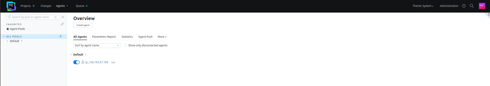
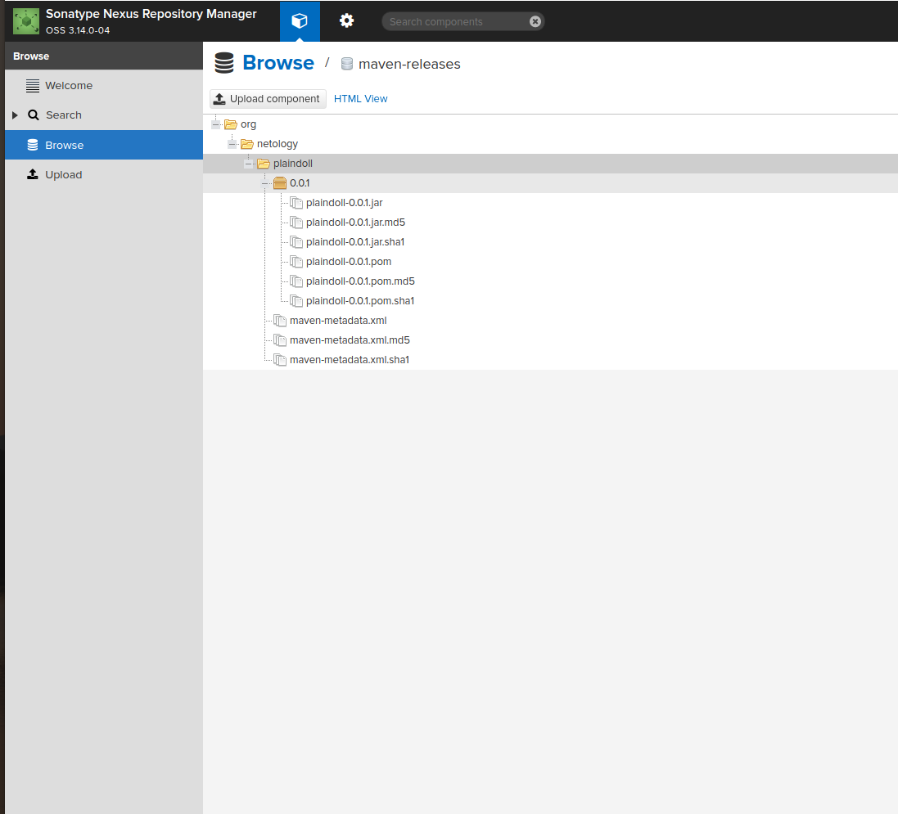
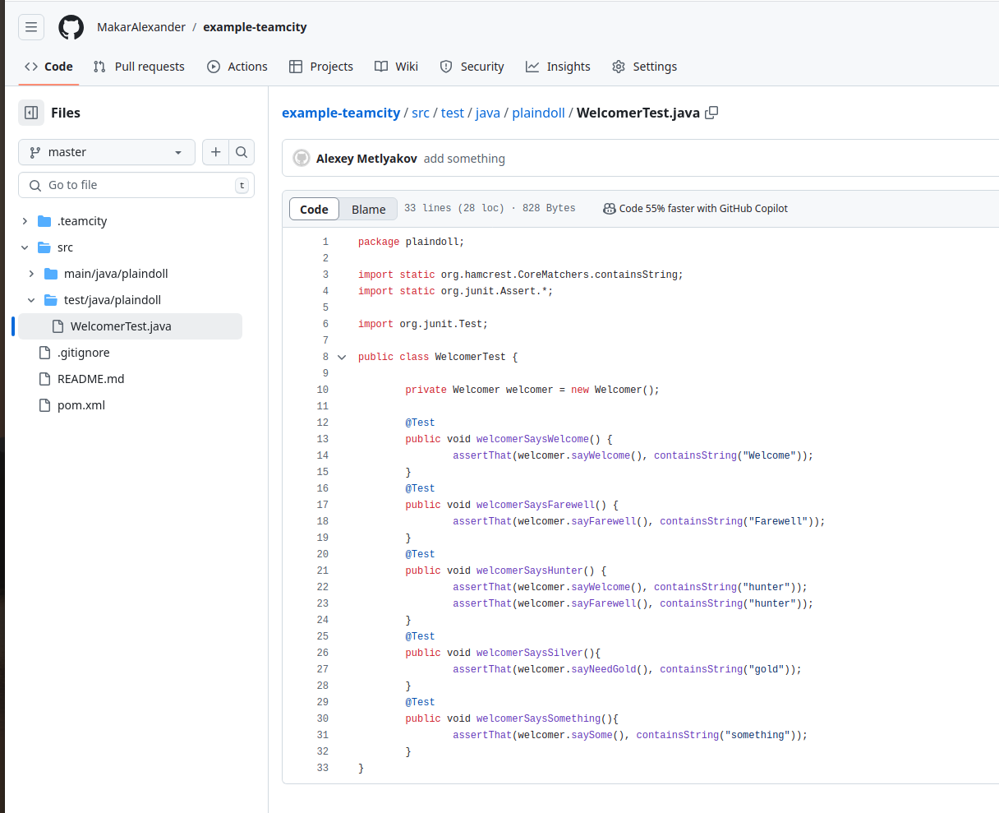

# Домашнее задание к занятию 11 «Teamcity» "Макарцев Александр Владимирович"

## Подготовка к выполнению

1. В Yandex Cloud создайте новый инстанс (4CPU4RAM) на основе образа `jetbrains/teamcity-server`.
2. Дождитесь запуска teamcity, выполните первоначальную настройку.
3. Создайте ещё один инстанс (2CPU4RAM) на основе образа `jetbrains/teamcity-agent`. Пропишите к нему переменную окружения `SERVER_URL: "http://<teamcity_url>:8111"`.
4. Авторизуйте агент.
5. Сделайте fork [репозитория](https://github.com/aragastmatb/example-teamcity).
6. Создайте VM (2CPU4RAM) и запустите [playbook](./infrastructure).

## Основная часть

1. Создайте новый проект в teamcity на основе fork.
2. Сделайте autodetect конфигурации.
3. Сохраните необходимые шаги, запустите первую сборку master.
4. Поменяйте условия сборки: если сборка по ветке `master`, то должен происходит `mvn clean deploy`, иначе `mvn clean test`.
5. Для deploy будет необходимо загрузить [settings.xml](./teamcity/settings.xml) в набор конфигураций maven у teamcity, предварительно записав туда креды для подключения к nexus.
6. В pom.xml необходимо поменять ссылки на репозиторий и nexus.
7. Запустите сборку по master, убедитесь, что всё прошло успешно и артефакт появился в nexus.
8. Мигрируйте `build configuration` в репозиторий.
9. Создайте отдельную ветку `feature/add_reply` в репозитории.
10. Напишите новый метод для класса Welcomer: метод должен возвращать произвольную реплику, содержащую слово `hunter`.
11. Дополните тест для нового метода на поиск слова `hunter` в новой реплике.
12. Сделайте push всех изменений в новую ветку репозитория.
13. Убедитесь, что сборка самостоятельно запустилась, тесты прошли успешно.
14. Внесите изменения из произвольной ветки `feature/add_reply` в `master` через `Merge`.
15. Убедитесь, что нет собранного артефакта в сборке по ветке `master`.
16. Настройте конфигурацию так, чтобы она собирала `.jar` в артефакты сборки.
17. Проведите повторную сборку мастера, убедитесь, что сбора прошла успешно и артефакты собраны.
18. Проверьте, что конфигурация в репозитории содержит все настройки конфигурации из teamcity.
19. В ответе пришлите ссылку на репозиторий.

#### Решение
- Создал новый проект в teamcity на основе fork.
- Сделал autodetect конфигурации.
- Сохранил необходимые шаги, запустил первую сборку master.

- Для deploy загрузил settings.xml в набор конфигураций maven у teamcity, предварительно записав туда креды для подключения к nexus.
- В pom.xml поменял ссылки на репозиторий и nexus.
- Запустил сборку по master, убедился, что всё прошло успешно и артефакт появился в nexus.

- Мигрировал build configuration в репозиторий.
- Создал отдельную ветку feature/add_reply в репозитории.

- Напиcал новый метод для класса Welcomer: метод должен возвращать произвольную реплику, содержащую слово hunter.
- Дополнил тест для нового метода на поиск слова hunter в новой реплике.
- Сделал push всех изменений в новую ветку репозитория.
- Убедился, что сборка самостоятельно запустилась, тесты прошли успешно. (однако допустил синтаксическую ошибку и поправлял её несколько раз)

- Внес изменения из произвольной ветки feature/add_reply в master через Merge.

- Убедился, что нет собранного артефакта в сборке по ветке master.
- Конфигурацию изначально настроена так, чтобы она собирала .jar в артефакты сборки.
- Провел повторную сборку мастера, убедился, что сбора прошла успешно и артефакты собраны.

Ссылка на репозиторий https://github.com/MakarAlexander/example-teamcity/tree/master

---

### Как оформить решение задания

Выполненное домашнее задание пришлите в виде ссылки на .md-файл в вашем репозитории.

---